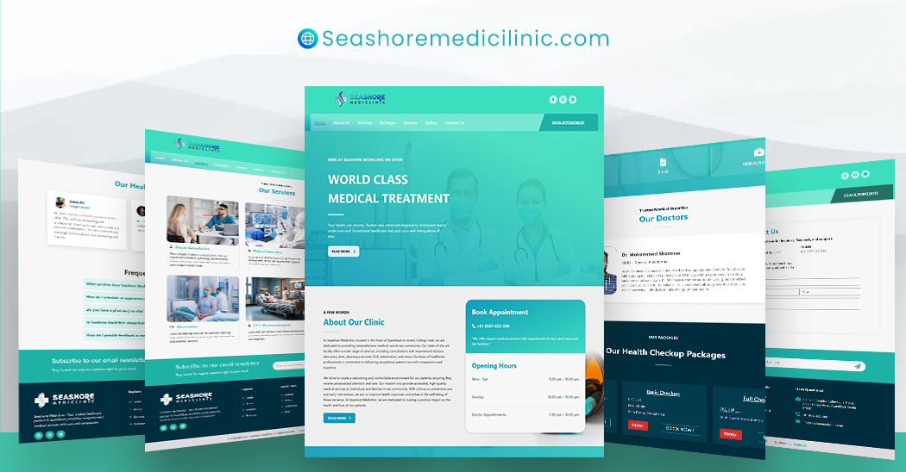

<div align="center">
  

  <h3 align="center" style="font-size: 42px;">Seashore Mediclinic</h3>

  <p align="center">
    A responsive and user-friendly website created using React for a local medical clinic.
    <br />
    <a href="#"><strong>Live Demo »</strong></a>
    <br />
    <br />
    <a href="#desc">Description</a>
    ·
    <a href="#clone">Replicate</a>
    ·
    <a href="#deploy">Deployment</a>
  </p>
</div>

<div align="center">

</div>

## <p align="center" id="desc">About Seashore Mediclinic</p>
  
Seashore Mediclinic is a comprehensive medical facility located in Ayanikkad, offering a wide range of services including consultations, laboratory tests, pharmacy services, and more. Our team of healthcare professionals provides exceptional patient care with compassion and expertise, aiming to improve health outcomes and enhance well-being in our community.

## 🛠️ Tech Stack

- [React](https://react.dev/)
- [Framer Motion](https://www.framer.com/motion/)
- [Deployed on Vercel](https://vercel.com/)   

<span id="clone"></span>
## 🛠️ Clone the project  

```bash
git clone https://github.com/thajucp123/seashore-mediclinic.git
```

```bash
npm install
``` 
or 
```bash
yarn install
```

<span id="deploy"></span>

## 🛠️ Deploy on Vercel  

Since react-router-dom is a client side router, Vercel does not properly support it as it is. So, in order to for the routes to work properly, we need to add the following ```vercel.json``` file in the root directory.

```json
{
    "rewrites": [
      { "source": "/(.*)", "destination": "/" }
    ]
  }
  
```

## 🙇 Author

#### Thajudeen CP

- LinkedIn: [@thaju-fakrudheen](https://www.linkedin.com/in/thaju-fakrudheen/)
- Github: [@thajucp123](https://github.com/thajucp123)